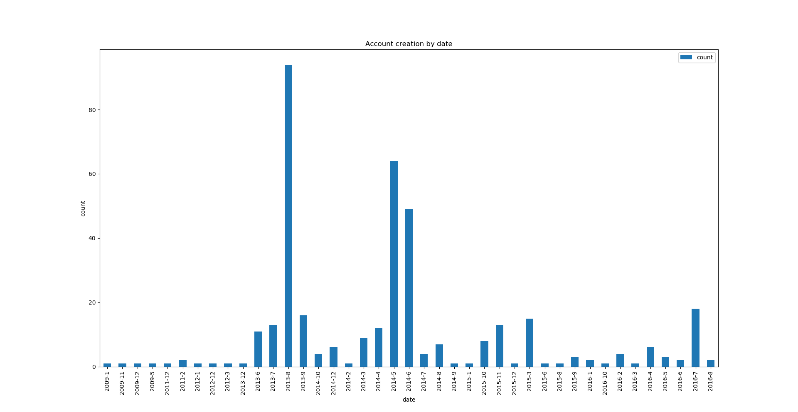
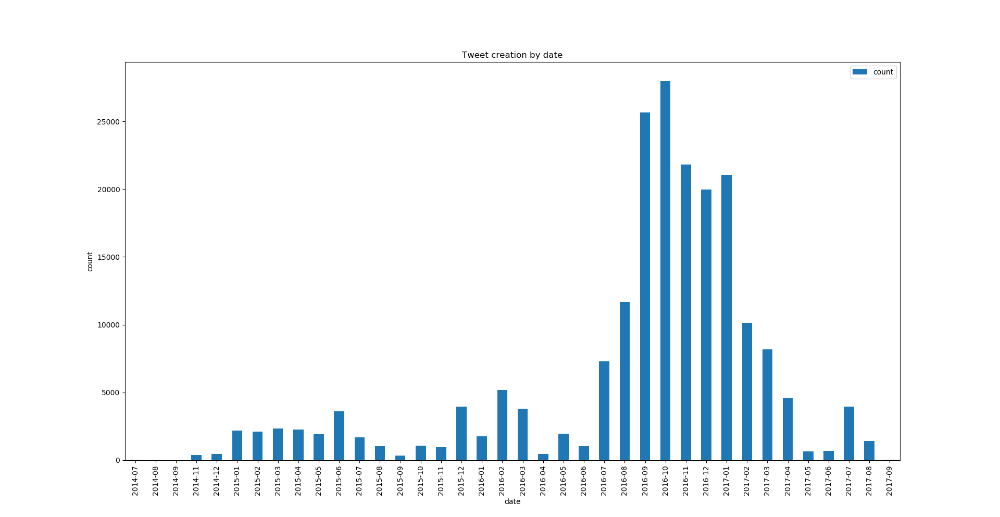
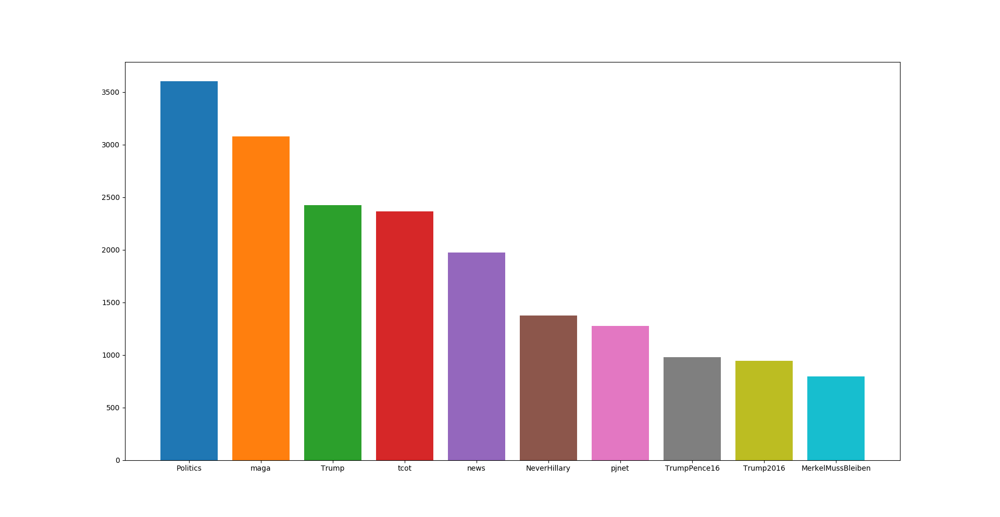

# Analiza tvitov ruskih trolov (vmesno poročilo)

## Člani skupine
* Žan Bizjak
* Gašper Mrak
* Matej Fajdiga
* Uroš Koritnik
* Jakob Kovačič

## Opis problema
Za projekt pri predmetu smo si izbrali podatkovno analizo tvitov ruskih "trolov", s katerimi naj bi Rusija vplivala na Ameriške volitve. Analizirali bomo vsebine tvitov, lastnosti računov in preko tega poskusili ugotoviti razne vzorce v objavah - najpogostejše fraze, prevladujoče "heštege", ciljne skupine, časovne intervale ipd. Hkrati bi tudi lahko vpeljali tvite in račune dejanskih uporabnikov, primerjali rezultate in tako morda ugotovili ključne razlike med njima.

## Podatki
[Začetne podatke](https://www.kaggle.com/vikasg/russian-troll-tweets), ki vsebujejo 200.000 tvitov, smo pridobili s Kaggla, in sicer dve CSV datoteki: "tweets" in "users". Prva vsebuje podatke o tvitih, druga pa o uporabnikih. Relacijsko se povezujeta prek atributa "user_id".

Našli smo [še ene podatke](https://github.com/fivethirtyeight/russian-troll-tweets), ki pa vsebujejo 3 milijone tvitov ruskih trolov. Te bomo po končani analizi manjših podatkov uporabili za primerjavo rezultatov.

## Analiza

### Časovna porazdelitev uporabnikov in tweetov

Datoteka "tweets" vsebuje attribut "tweet_id", s katerim lahko pregledujemo medsebojno povezanost tweetov trolov. Preko te informacije in s predpostavko, da se v tweetih nahajajo le troli, lahko ugotovimo ali so ciljali na uporabnike izven naših podatkov, ali so tweete razširjali in popularizirali le med seboj.

Problem v podatkih je tudi, da najstarejši tweet seže le do julija 2014, najstarejši uporabnik pa vse do januarja 2009. Z izrisom grafov porazdelitve tweetov in nastanka računov po času lahko vidimo z metodo ostrega očesa, da se gostota periodično viša.

Graf prikazuje število ustvarjenih računov glede na mesec. Opazimo dva izrazita vrhova v porazdelitvi in eno kasnejše izstopanje. Z uporabo Wikipedijinega portala Current Events smo poskušali povezati vrhove s svetovnimi dogodki in smo prišli do ugotovitve, da sovpadajo z glavnimi ruskimi političnimi potezami in sicer:

* Začetek prvega izstopanja sovpada s Snowdenovim priznanjem "žvižgaštva" zaupnih dokumentov NSA in začetkom raziskave uporabe kemičnega orožja v Siriji. Vrh doseže ko Snowdnu podeli Rusija azil in na vrhuncu raziskave v Siriji.

* Drugo izstopanje sovpada s Krimsko krizo, v kateri si je Rusija priključila polotok. Natančnih dogodkov, poleg priključitve, nismo zasledili.

* Zadnje izstopanje sovpada z začetkom partijskih volitev v ZDA, kjer naj bi troli imeli vlogo pri izvolitvi Donalda Trumpa. Zaradi nizkega števila prijavljenih računov pa je možno, da nanj gledamo tudi kot osamelec, saj so prejšnji vzorci vrhov vsebovali vsaj štiri zaporedne mesece povečanega števila računov skupaj z izrazitim vrhom.

Graf prikazuje število objavljenih tweetov glede na mesec. Razberemo lahko tri obdobja povečanega tweetanja. Podobno kot zgoraj smo poiskali sovpadanja s svetovnimi dogodki.

* Prvo obdobje sovpada z ameriškimi sankcijami na Severno Korejo ter s terorističnim napadom na francoski satirični tednik Charlie Hebdo.

* Drugo obdobje ne sovpada s svetovnimi dogodki, ampak zdi se, da število tweetov narašča z naraščajočo priljubljenostjo Donalda Trumpa in njegovo kandidaturo.

* Tretje obdobje sovpada z začetkom partijskih volitev v ZDA, podobno kakor v prejšnjem grafu. Dogodka odgovorna za vrhova sta predsedniška debata med Donaldom Trumpom in Hillary Clinton, ter škandal slednje glede njenega upravljanja zaupnih dokumentov medtem, ko je bila zaposlena v Beli Hiši.

### Hashtagi

Hashtagi so osrednji način za označevanje tematik na Twitterju. Prek njih lahko razberemo ne le tematiko, ampak tudi opredeljenost uporabnika glede nje. Služijo lahko kot preprosto izhodišče za nenadzorovano učenje, za razliko od tekstovne analize celotnega tweeta. Prek najdenih skupin uporabnikov bomo lahko nato razbrali vzorce delovanja trolov, najpogostejše citirane medije, fraze, "false flag" napade...

Osnovni graf hashtagov glede na število pojavitev prikazuje porazdelitev desetih najpogostejših hashtagov. Najzanimivejša sta #pjnet in #MerkelMussBleiben. Prvi je okrajšava za Patriot Journalist Network, družba ki je med volitvami na Twitterju vzdrževala bota, ki naj bi vsak dan objavil tisoč tweetov.
Slednja pa namiguje, da so troli komentirali tudi zadeve izven Ameriške sfere.
